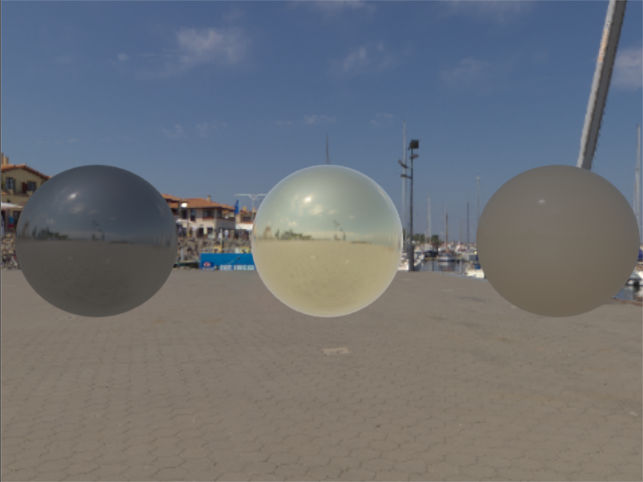

# HDX-  Vulkan Realtime Rendering Engine

## Overview

This project is a Vulkan-based 3D rendering engine developed in C++. The engine is designed to showcase advanced rendering techniques and real-time graphics features. It includes various examples and implementations of modern rendering techniques, making it a robust foundation for graphics programming and engine development.



## Features

### Lighting & Shading
- **Blinn-Phong Lighting Model**: Implemented to provide basic lighting with specular highlights.
- **Physically Based Rendering (PBR)**: Utilizes the Cook-Torrence BRDF for realistic material rendering.
- **Image-Based Lighting (IBL)**: Supports environment lighting using HDR textures and precomputed irradiance maps.

### Texturing & Mapping
- **Normal Mapping**: Enhances surface details by simulating small-scale bumps and dents.
- **HDR Textures**: Uses high dynamic range textures for more realistic lighting and color intensity.

### Environment Effects
- **Cube Maps**: Used for environment mapping and skyboxes.
- **Environment Mapping**: Implements reflective and refractive materials using cube maps.

### Rendering Techniques
- **Instanced Rendering**: Efficiently renders multiple instances of objects with varying transformations.
- **Multi-Sample Anti-Aliasing (MSAA)**: Provides smoother edges by sampling a pixel multiple times at different locations.

### Advanced Features
- **Compute Shaders**: Used for various tasks including physics simulations and map generation.
- **Particle Simulation**: Implements a real-time particle system using compute shaders.
- **Generated Irradiance, Prefiltered Environment, and BRDF LUT Maps**: These maps are generated using compute shaders to support advanced lighting models.

## Installation & Usage

### Prerequisites
- **Vulkan SDK**: Ensure you have the Vulkan SDK installed on your system.
- **C++ Compiler**: A modern C++ compiler that supports C++17 or later.
- **CMake**: Used for building the project.

### Building the Project
1. **Clone the repository**:
   ```bash
   git clone https://github.com/nahiim/HDX.git
   cd HDX
   ```
2. **Create a build directory and generate project files:**
   ```
   mkdir build
   cd build
   cmake ..
   ```