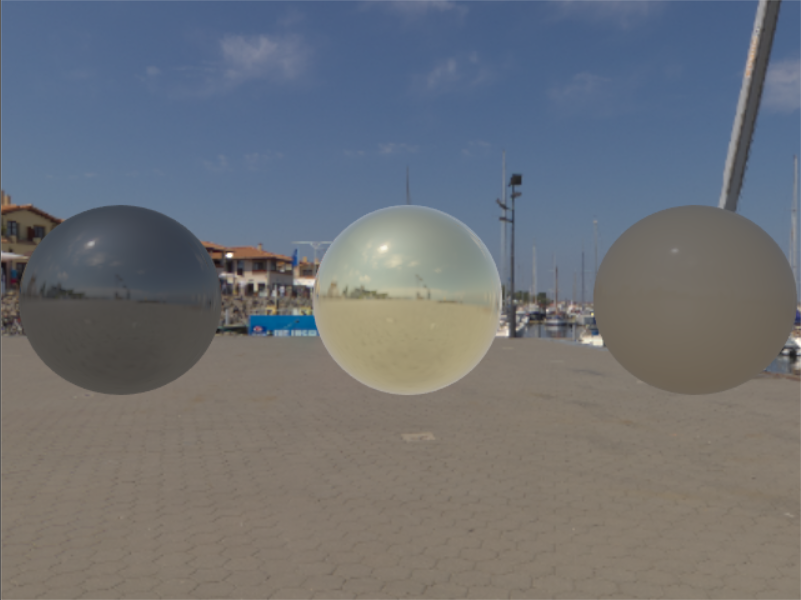
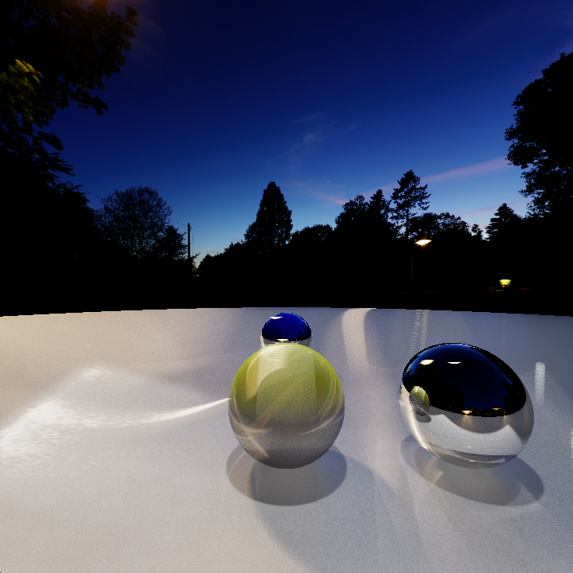
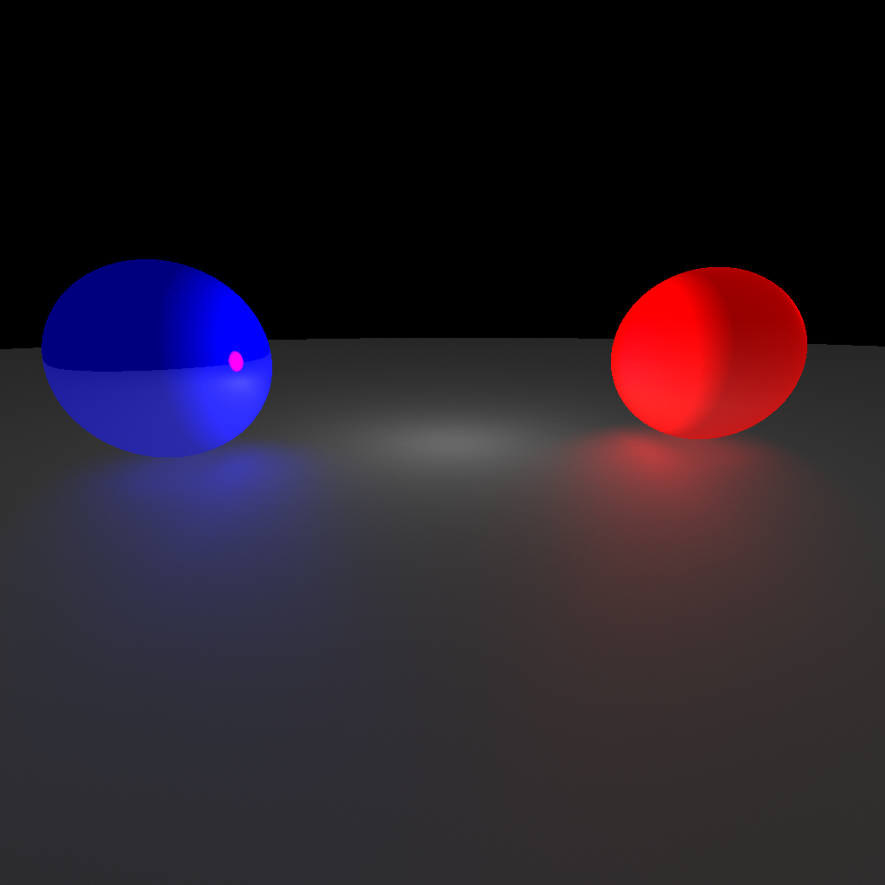
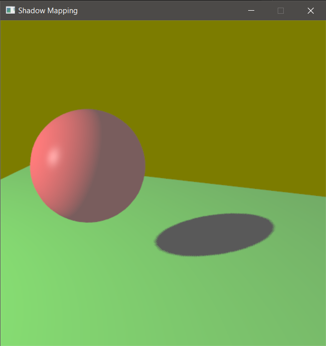

# HDX-  Vulkan Realtime Rendering Engine

## Overview

This project is a Vulkan-based 3D rendering engine developed in C++. The engine is being developed as a learning exercise and to showcase advanced rendering techniques and real-time graphics features. It includes various examples and implementations of modern rendering techniques, making it a robust foundation for graphics programming and engine development.








## To Run Samples

### Prerequisites
- **Vulkan SDK**: Ensure you have the Vulkan SDK installed on your system.
- **C++ Compiler**: A modern C++ compiler that supports C++17 or later.
- **CMake**: Used for building the project.

### Building the Project
1. **Clone the repository**:
   ```bash
   git clone https://github.com/nahiim/HDX.git

   ```
2. **Navigate to a sample directory and generate project files:**
   ```
   cd HDX
   cd samples <XX_Sample_name>
   cmake -B build -S .
   ```
3. **Run sample:**
   ```
   cd build
   Open the .sln file
   set as startup project
   Run
   ```

